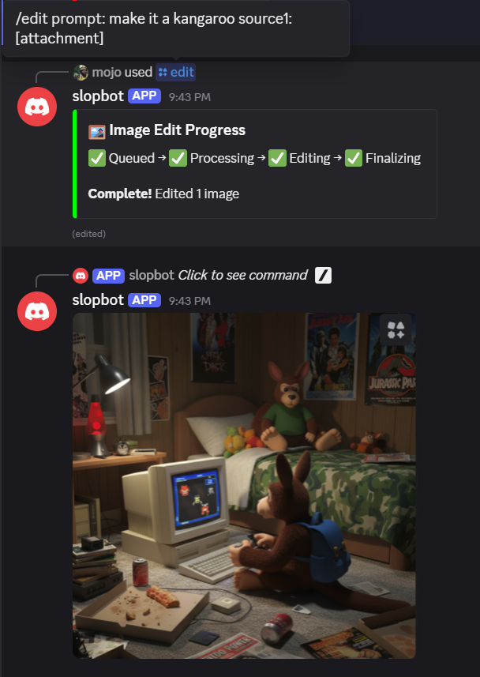
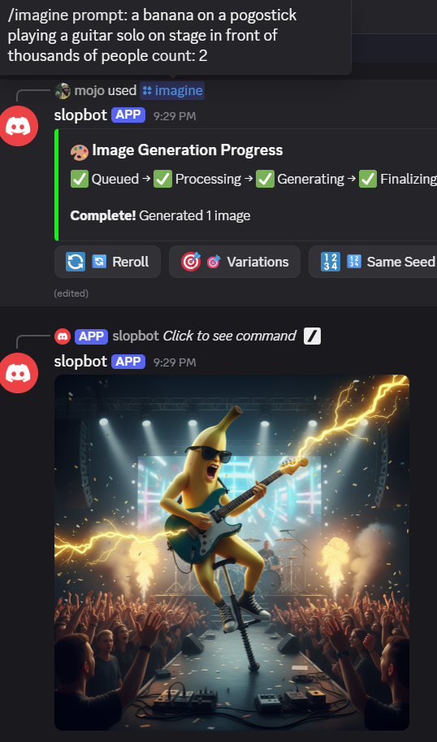

<!-- filepath: c:\Users\kyle\projects\slopbot\README.md -->
# gemini-nano-banana-discord-bot


Vibe coded with RooCode.

## 🛠️ Development Tools & AI Integrations

[]() []() []() []() []() []() []() []()

[](LICENSE)
[](https://python.org)
[](https://discordpy.readthedocs.io/)
[](https://openrouter.ai/)

gemini-nano-banana-discord-bot is a Python-based Discord bot that enables creative image manipulation commands, including generating new images from text prompts, editing existing images, and blending multiple images together. Built with modern AI models and optimized for seamless integration into Discord servers.

The bot is a discord.py application that registers slash commands and calls an OpenRouter-backed client to generate/edit/blend images. A small FastAPI/uvicorn health server runs alongside the bot (port 8000).

This document focuses on the realistic steps required to get the project running (Docker and local), the required environment variables, Discord Developer Portal notes, and common troubleshooting items observed in the code.

What is actually implemented (quick map)

- `src/bot.py` — bot entrypoint, slash command definitions and registration, starts uvicorn health server.
- `src/commands/*.py` — command handlers (`imagine`, `edit`, `blend`, `help`, `info`) that validate input and enqueue work.
- `src/commands/utils/openrouter.py` — OpenRouter HTTP client with retry and response parsing used by commands.
- `src/commands/utils/storage.py` — local cache helpers (uses `CACHE_DIR`).
- `src/utils/config.py` — loads environment variables and raises on missing required keys (see list below).
- `Dockerfile` / `docker-compose.yml` — simple container that mounts `.env` and `.cache`.

Running the project

With Docker (recommended for quick self-hosting):

1. Ensure `.env` is populated.
2. Start the container (PowerShell):

docker compose up --build -d
``` 

3. Inspect logs:

docker compose logs -f
``` 

Notes:

- `docker-compose.yml` mounts `./.env` into the container and mounts `./.cache` to `/app/.cache` for local caching. That matches the code which reads `CACHE_DIR` (defaults to `.cache`).
- The container runs `python -m src.bot` (see `Dockerfile`). The bot will start and attempt to sync slash commands and start the health server on port 8000.

Discord Developer Portal notes

1. Create an application and bot at https://discord.com/developers.
2. Under OAuth2 → URL Generator, select scopes: `bot` and `applications.commands`.
3. Minimum bot permissions for testing: `Send Messages`, `Attach Files`, `Use Slash Commands`. Use Administrator only for convenience during early testing.
4. Invite the bot to a test server with the generated URL.

Slash command syncing

- On ready, `src/bot.py` calls `await self.tree.sync()` to register commands. If commands don't appear, confirm the token belongs to the same application you used to generate the invite and that the application has the `applications.commands` scope.

Commands (what's wired)

- /imagine — text → image generation. Arguments: prompt, style, count, seed, format. Uses `src/commands/imagine.py`.
- /edit — edit existing images. Requires at least one image attachment (source1). Uses `src/commands/edit.py`.
- /blend — blend 2-6 images together. Uses `src/commands/blend.py`.
- /help, /info — basic helpers.

Important runtime behaviors observed in the code

- The bot raises an error and exits if `DISCORD_TOKEN` is not set (check `src/bot.py`). If you see "DISCORD_TOKEN not found in .env", populate `.env`.
- The OpenRouter client raises if `OPENROUTER_API_KEY` is missing (check `src/commands/utils/openrouter.py`).
- Health server: uvicorn is launched inside the same process; container exposes port 8000 for health checks.
- Cache: `src/commands/utils/storage.py` uses `CACHE_DIR` (default `.cache`) and will create the directory if missing.

Troubleshooting (quick)

- Container exits immediately on start: run `docker compose logs --no-color` and look for a `ValueError` about missing env vars (likely `DISCORD_TOKEN` or `OPENROUTER_API_KEY`).
- Slash commands failing to sync: ensure bot token and invite are from the same application; re-invite the bot with `applications.commands` scope.
- OpenRouter API errors/timeouts: check `OPENROUTER_BASE_URL`, `MAX_RETRIES`, and network connectivity; logs in `src/commands/utils/openrouter.py` include detailed debug messages when enabled.
- File upload validation: the code enforces allowed types and max size (defaults in `src/utils/config.py`).

Tests and development

- Tests: there is a `tests/` folder. Run `pytest` after installing dev dependencies (see `pyproject.toml`).
- Linting / typing: project includes `pyrightconfig.json` and recommends standard tools but they are not enforced by the runtime.

[Back to top](#slop-bot)

gemini-nano-banana-discord-bot offers a comprehensive suite of image manipulation tools:

- **AI Image Generation**: Create original images from text descriptions using state-of-the-art models
- **Image Editing**: Modify existing images with natural language prompts
- **Image Blending**: Combine multiple images with various blend modes
- **High-Quality Output**: Support for multiple resolutions and quality settings
- **Real-time Processing**: Fast generation with OpenRouter's optimized infrastructure
- **Discord Integration**: Seamless bot commands in Discord servers and DMs
- **Flexible Prompting**: Support for detailed descriptions, styles, and artistic references
- **Batch Processing**: Handle multiple requests with intelligent queuing

### Supported Models

Google Gemini 2.5 Flash Image Preview - via OpenRouter

## Quick Start

### 1. Invite the Bot

To add gemini-nano-banana-discord-bot to your Discord server, you'll need to create an invite link from the Discord Developer Portal:

1. Go to https://discord.com/developers/applications
2. Select your bot application
3. Go to OAuth2 → URL Generator
4. Select scopes: `bot` and `applications.commands`
5. Select the required bot permissions (minimum: Send Messages, Attach Files, Use Slash Commands)
6. Copy the generated URL and use it to invite the bot to your server

Example invite URL format:
```
https://discord.com/api/oauth2/authorize?client_id=YOUR_CLIENT_ID&permissions=8&scope=bot%20applications.commands
```

*Note: Replace `YOUR_CLIENT_ID` with your actual bot's client ID from the Discord Developer Portal.*

### 2. Get Started

In any Discord channel where the bot has permission, type:

```
/help
```

The bot will respond with available commands and usage instructions.

### 3. Generate Your First Image

Try this simple command:
```
/imagine prompt:a beautiful sunrise over mountains
```

The bot will generate and post an image based on your prompt within seconds.

### 4. Explore Advanced Features

Use more sophisticated prompts:
```
/imagine prompt:a cyberpunk city at night, neon lights, detailed architecture style:digital art quality:9
```

## Screenshots

See your creative results in action:

### Edit Screenshot


### Imagine Banana Screenshot


### Imagine Pig Screenshot


## Commands

### `/imagine`
Generate new images from text descriptions.

**Usage:**
```
/imagine prompt:<description> [style:<style>] [quality:<1-10>] [aspect:<ratio>]
```

**Examples:**
- Basic: `/imagine prompt:a cat playing piano`
- Styled: `/imagine prompt:sunset landscape style:oil painting`
- High-res: `/imagine prompt:macro photograph of flower quality:10`

**Sample Output:**
```
Bot Response:
✨ *Processing your request...*

🎨 *Generating images...*

🔧 *Post-processing 1 generated image...*

[Image: A beautiful sunrise over mountains with vibrant orange and purple colors, rendered in high detail matching the AI model's capabilities]
```

*Figure 1: Sample /imagine command showing the multi-stage progress indicators and generated image*

### `/edit`
Modify existing images with AI-powered editing.

**Usage:**
```
/edit image:<attachment or URL> prompt:<changes>
```

**Examples:**
- Add objects: `/edit image:<photo.jpg> prompt:add sunglasses to the person`
- Style transfer: `/edit image:<painting.jpg> prompt:convert to water color`
- Enhancement: `/edit image:<old_photo.jpg> prompt:colorize and enhance quality`

**Before and After Example:**
```
Original: [Sunset photo without text overlay]
Command: /edit prompt:add "Welcome to Paradise" text in elegant script

Generated: [Attached image with the same sunset scene, now featuring beautiful script text reading "Welcome to Paradise" positioned artistically over the horizon]
```

*Figure 2: Before/after comparison showing how the /edit command adds text elements to an existing image*

### `/blend`
Combine two images with different blend modes.

**Usage:**
```
/blend image1:<img1> image2:<img2> [mode:add|multiply|overlay]
```

**Examples:**
- Portrait swap: `/blend image1:<face1.jpg> image2:<face2.jpg>`
- Landscape merge: `/blend image1:<sky.jpg> image2:<ground.jpg>`
- Creative composite: `/blend mode:overlay`

**Blend Result:**
```
Command: /blend image1:[Photo of sunset sky] image2:[Photo of ocean waves]

Blended Output: [Single cohesive image showing sunset sky seamlessly blended with ocean waves creating a surreal landscape]
```

*Figure 3: Example of how the /blend command combines two different images into one cohesive composition*

### `/info`
Get information about bot status, models, and usage.

**Usage:**
```
/info [topic:models|status|usage]
```

### `/help`
Display help information for all commands.

**Usage:**
```
/help [command:<command_name>]
```

## API Reference

### `/imagine` - Generate Images from Text

**Full Parameters:**
```yaml
Required:
- prompt: str (1-1000 chars) - Text description of the image to generate

Optional:
- style: str - Artistic style (photorealistic, anime, sketch, cartoon, abstract)
- count: int (1-4) - Number of images to generate (default: 1)
- seed: int - Random seed for reproducible results (default: random)
- format: str (png, jpg, webp) - Output image format (default: png)
```

**Response Format:**
- Progress messages: Queue processing, validation, generation, post-processing
- Image attachment(s) with Discord files
- Metadata embed with: prompt, style, seed, model, generation count

### `/edit` - Edit Existing Images

**Full Parameters:**
```yaml
Required:
- prompt: str (1-512 chars) - Description of changes to make
- source1: Discord Attachment - Primary source image (PNG/JPG/WebP <10MB)

Optional:
- source2, source3, source4: Discord Attachments - Additional source images
- mask: Discord Attachment - Optional mask image for precise editing
- format: str (png, jpg, webp) - Output format (default: png)
```

**Response Format:**
- Progress: validation, preparation, generation, post-processing
- Edited image attachment
- Metadata embed with: original prompt, model, sources used, mask usage

### `/blend` - Combine Multiple Images

**Full Parameters:**
```yaml
Required:
- prompt: str (1-512 chars) - Blending prompt/description
- source1, source2: Discord Attachments - Source images to blend (>=2, <10MB each)

Optional:
- source3, source4: Additional Discord Attachments
- strength: float (0.0-1.0) - Blend strength (default: 0.5)
- format: str (png, jpg, webp) - Output format (default: png)
```

**Response Format:**
- Progress indicators for validation, prep, generation, post-processing
- Blended image attachment
- Metadata: prompt, strength, sources count, model

## Rate Limiting

- **/imagine**: 5 generations per 5 minutes per user
- **/edit**: No rate limit currently implemented
- **/blend**: 15 blends per 60 seconds per user
- Additional server-wide limits apply

## Prerequisites

- Discord account with permission to add bots
- Server admin rights to configure bot permissions
- Optional: OpenRouter account for API access (admin only)

## Configuration

For advanced setups, see our detailed configuration guide:

- [Full Configuration Guide](CONFIG.md)
- [Discord App Setup](SELF_HOSTING.md)
- [Deployment Options](DEPLOYMENT.md)

## Examples

Check out our extensive examples collection:

- [Command Examples and Demos](docs/examples.md)

## Frequently Asked Questions (FAQ)

### General Questions

**Q: Is the bot free to use?**
A: Yes! The bot is free to use. The OpenRouter API costs are covered by the bot owner, within reasonable limits.

**Q: What are the usage limits?**
A: Free tier: 100 generations per day per server. Premium options available for higher limits.

**Q: Can I use the bot in DMs?**
A: Yes, you can use all commands in direct messages with the bot.

**Q: What image formats are supported?**
A: Input: PNG, JPG, JPEG, GIF, WebP. Output: PNG (generation), same as input (editing).

**Q: How do I report bugs or suggest features?**
A: Visit our GitHub repository to create issues for bugs or feature requests. For quick help, use `/help` or check our FAQ.

### Technical Questions

**Q: Why is the bot not responding?**
A: Check if the bot has the required permissions in your server. Try `/info` to check bot status.

**Q: My images are taking too long to generate**
A: This may be due to high demand. Try lower quality settings or wait a few minutes.

**Q: The bot says my prompt is inappropriate**
A: Our content filters block certain types of content. Review our content policy and try rephrasing your prompt.

**Q: Can I use my own API key?**
A: Currently, only the default OpenRouter account is supported. Custom keys may be added in future versions.

**Q: How do I cancel a generation in progress?**
A: Use the ❌ reaction on the bot's message to cancel. Note that credits may still be charged.

### Troubleshooting

#### Common Errors & Solutions


## Recent changes (Edit-button and iteration improvements)

The following updates were made to improve the image editing UX and iteration flow. These changes add an Edit button to generation completion embeds and enable iterating on edited images as well.

Files changed
- `src/commands/utils/queue.py`
   - Added `ImageIterationView` support for an "✏️ Edit" button and modal.
   - Attached the iteration view (Reroll / Variations / Same Seed / Edit) to both `/imagine` and `/edit` completion embeds.
   - When `/edit` completes, edited images are written to `CACHE_DIR` as temp files and new `discord.File` objects are created from disk before sending. This avoids empty/consumed file-like objects.
   - The Edit modal can accept an image index to choose which generated/edited image to re-edit. It also accepts saved local file paths (so re-edits of generated outputs work reliably).

- `src/commands/utils/openrouter.py`
   - No functional changes were required, but it was used by the queue changes to parse/return `GeneratedImage` objects that the queue now consumes.

Behavior changes
- A new "✏️ Edit" button appears alongside iteration buttons on generation embeds. Clicking it opens a modal to enter an edit prompt and optional image index.
- The edit prompt is displayed inside the edit progress embed (no duplicate prompt text is sent as a separate message).
- Edited images are saved to `CACHE_DIR` and the iteration buttons reference those saved files so you can reroll, vary, or re-edit edited images.

How this fixes a common failure
- Previously, when the code attempted to re-use in-memory `BytesIO` or `discord.File` objects that had been consumed (read/seeking issues), Discord would show a broken attachment (placeholder). Writing image bytes to temp files and creating fresh `discord.File` objects prevents that problem.

How to test these changes
1. Start the bot and try `/imagine` to generate an image.
2. Click the "✏️ Edit" button on the generate progress embed and submit an edit prompt in the modal.
3. When edit completes, confirm:
    - The edit progress embed shows the full `**Prompt:**` text.
    - The iteration buttons are visible on the embed.
    - Clicking Reroll/Variations/Same Seed/✏️ Edit works for the edited output.

Troubleshooting tips
- If you see an empty or broken image after editing, check the bot logs for messages about failing to write temp files or file-not-found warnings.
- Ensure `CACHE_DIR` (default `.cache`) is writable by the process and not cleared between generation and edit steps.
- If iteration still fails, paste the `docker compose logs --tail 200` output and I will inspect the stack trace.

If you want the Edit modal to pre-fill the original generation prompt or to surface the seed/style metadata in the modal, I can add that in a follow-up change.
**🔧 Bot Not Responding**
- Check if bot has "Send Messages" and "Attach Files" permissions in server settings
- Verify bot is online by running `/info topic:status`
- Try `/help` command to test basic functionality
- Wait 2-3 minutes and retry - there may be a temporary service issue

**🖼️ Image Quality Issues**
- Use higher quality settings (8-10) for better results
- Be more specific in prompts: "architectural photograph" vs just "photo"
- Reference specific art styles: "in the style of Ansel Adams"
- Try adding technical details: "8K resolution, detailed textures, professional lighting"

**⚡ Rate Limit Errors**
- Wait for cooldown period (typically 15 minutes for API limits)
- Contact server admin if you hit server-wide limits
- Private message the bot to use personal rate limits separately
- Reduce request frequency during peak hours

#### Advanced Troubleshooting

**❌ "Image validation failed"**
- Ensure image file is PNG, JPG, JPEG, GIF, or WebP format
- Check file size is under 10MB
- Verify image is not corrupted - try a different file
- Try URL attachment if direct upload fails

**⏱️ "Request timed out"**
- Wait 1-2 minutes and retry
- Simplify your prompt for faster processing
- Try a smaller batch size for multiple images
- Check `/info topic:status` for system status

**🚫 "Content filtered"**
- Review community's content policy
- Re-word prompt to be appropriate
- Remove offensive or inappropriate terms
- Be more specific with artistic intent

**🔗 "URL attachment error"**
- Ensure URL is direct to image file (ends with .jpg, .png, etc.)
- Verify link is publicly accessible
- Try copying image directly to Discord instead
- Check if URL requires authentication

#### Getting Help

**Quick Self-Help:**
1. Run `/info topic:status` - Bot health and queue
2. Run `/help` - Verify commands are available
3. Try in DM with bot - Test one-on-one
4. Clear browser cache if using web client

**Support Channels:**
- Both server links broken? Check GitHub Issues for known bugs
- Feature requests: Post on GitHub Discussions
- Complex issues: Contact server administrators
- System status: Monitor via bot commands or log files

**Prevention Tips:**
- Save successful prompts for reuse
- Start with basic quality for quick iterations
- Batch commands to avoid rate limits
- Test in staging/DM before production use

## Rate Limiting & Usage Limits

### Bot-Level Rate Limits

**Per-User Limits:**
- **`"/imagine"`**: 5 generations per 5 minutes
- **`"/edit"`**: No rate limit currently implemented
- **`"/blend"`**: 15 blends per 60 seconds
- **`"/info"`**: 10 requests per 60 seconds
- **`"/help"`**: 5 requests per 60 seconds

**Server-Wide Limits:**
- Total API calls: 100 per server per day (free tier)
- Premium options available for higher limits
- Queue processing: FIFO with fair distribution

### OpenRouter API Limits

**Global Limits:**
- Rate limits vary by model and tier
- Typical: 50-200 requests per minute
- Burst allowance for normal usage
- Automatic cooldown handling

**Fair Usage Policy:**
- Exponentially back off on failures
- Queue system prevents rate limit spikes
- Configurable limits via `.env` settings
- Real-time monitoring and adjustment

### Managing Rate Limits

**If You Hit Limits:**
1. **Immediate Actions:**
   - Wait for cooldown (check `/info topic:status`)
   - Use lower quality/tier prompts
   - Try again in 15-30 minutes

2. **Long-Term Solutions:**
   - Upgrade to premium plan
   - Contact server admin for higher limits
   - Use personal rate limits via DM
   - Schedule large batches off-peak

3. **Optimization Tips:**
   - Combine similar requests
   - Use batch generation wisely
   - Monitor usage with `/info topic:usage`
   - Start small, scale up gradually

### Rate Limit Monitoring

**Check Current Status:**
```bash
/info topic:status  # Bot health and queue
/info topic:usage   # Your personal statistics
```
**Rate Limit Exceeded:**
```
❌ Rate limit reached
⏰ Next available: 3 minutes
💡 Try reducing batch size or quality
```
**Fair Usage Exceeded:**
```
⚠️ Usage limit reached
📊 Monthly count: 8,345/10,000
🔄 Resets in 16 days
```

## Development Workflow

1. Fork the repository
2. Create a feature branch
3. Make changes and add tests
4. Ensure all tests pass
5. Create a pull request with conventional commit format

See [Contributing Guide](CONTRIBUTING.md) for detailed workflow.

## System Architecture

### High-Level Design

```
┌─────────────────┐    ┌─────────────────┐    ┌─────────────────┐
│   Discord Bot   │◄──►│  Async Queue    │◄──►│  OpenRouter API │
│   (Commands)    │    │   Processing     │    │   Generation    │
└─────────────────┘    └─────────────────┘    └─────────────────┘
         ▲                                                │
         └───────────►┌─────────────────┐◄───────────────┘
                     │   Core Utils     │
                     │ - Validation     │
                     │ - Rate Limiting  │
                     │ - Error Handling │
                     │ - Logging        │
                     │ - Caching        │
                     └─────────────────┘
                              ▲
                     ┌────────┴────────┐
            ┌────────▼────────┐ ┌─────▼─────┐
            │ Configuration   │ │ Preferences│
            │  Management     │ │ Storage    │
            └─────────────────┘ └───────────┘
```

### Component Overview

#### 🖥️ Discord Bot Component
**Responsibilities:**
- Command parsing and validation
- Discord API integration
- User interaction handling
- Error presentation

**Key Files:**
- `src/bot.py` - Main bot entry point
- `src/commands/*.py` - Individual command handlers
- `src/health_check.py` - Monitoring endpoints

#### 🚦 Async Processing Queue
**Responsibilities:**
- FIFO request queuing
- Background worker management
- Concurrent request handling
- Load balancing

**Key Files:**
- `src/commands/utils/queue.py` - Queue implementation
- Async/acquire background task
- FIFO with configurable workers

#### 🤖 AI Generation Service
**Responsibilities:**
- OpenRouter API integration
- Image generation coordination
- Error retry with exponential backoff
- Model selection and switching

**Key Files:**
- `src/commands/utils/openrouter.py` - API client
- Model management and routing
- Authentication handling

#### 🛠️ Core Utilities
**Responsibilities:**
- Input validation and sanitization
- Rate limiting and abuse prevention
- Error handling and logging
- Image processing and caching

**Key Files:**
- `src/commands/utils/validators.py` - Validation logic
- `src/commands/utils/rate_limiter.py` - Rate limiting
- `src/commands/utils/error_handler.py` - Error management
- `src/commands/utils/logging.py` - Structured logging
- `src/commands/utils/images.py` - Image processing
- `src/commands/utils/storage.py` - Cache management

#### ⚙️ Configuration Management
**Responsibilities:**
- Environment variable handling
- Runtime configuration loading
- Feature flag management
- Settings validation

**Key Files:**
- `src/utils/config.py` - Centralized configuration
- `.env.example` - Template file
- Runtime validation and defaults

### Data Flow Architecture

#### Request Flow:
1. **User Input** → Discord Command
2. **Validation** → Input sanitization & rate checking
3. **Queueing** → Async FIFO processing order
4. **Processing** → AI generation via OpenRouter
5. **Caching** → Store generated files locally
6. **Response** → Discord file attachment with metadata
7. **Cleanup** → Automatic temp file management

#### Error Handling Flow:
1. **Exception Detection** → Catch in appropriate layer
2. **Error Categorization** → User, API, system errors
3. **Response Formatting** → User-friendly error messages
4. **Logging** → Structured error recording
5. **Recovery** → Auto-retry for transient failures

#### Scaling Considerations:
- **Horizontal Scaling**: Queue can handle multiple workers
- **Rate Limiting**: Multi-level limits (user, server, API)
- **Caching**: Local file cache reduces API calls
- **Configurable**: All parameters via environment variables
- **Monitoring**: Health check endpoints for observability

### Security Architecture

#### Authentication:
- Discord OAuth2 bot token validation
- OpenRouter API key secure storage
- Role-based command permissions

#### Input Validation:
- Content filtering for inappropriate prompts
- File type and size restrictions
- URL validation for remote images

#### Abuse Prevention:
- Rate limiting per user/command/server
- Queue depth limits
- Timeout protections
- Usage monitoring

#### Data Protection:
- No user prompt storage (transient only)
- Secure API key handling
- Environment variable validation

### Monitoring & Observability

#### Health Monitoring:
- `/healthz` - Basic health check
- `/ready` - Readiness probe
- `/metrics` - Performance metrics

#### Logging Structure:
- Structured JSON logging
- Multiple log levels (debug, info, warning, error)
- Component-specific loggers
- Redaction of sensitive data

#### Metrics Tracking:
- Request success/failure rates
- Processing latency distribution
- Queue depth monitoring
- Memory/CPU resource usage

## Support

- **Documentation**: Check all guides in the `/docs` folder
- **Community**: Connect with other users and developers on GitHub
- **Issues**: Report bugs via GitHub Issues
- **Feature Requests**: Post ideas on GitHub Discussions

## Contributing

We welcome contributions! Please read our [Contributing Guide](CONTRIBUTING.md) for getting started.

## License

This project is licensed under the MIT License - see the [LICENSE](LICENSE) file for details.

## Changelog

See [CHANGELOG.md](CHANGELOG.md) for version history and updates.

---

*Made with ❤️ by the gemini-nano-banana-discord-bot community*

[⬆ Back to top](#slop-bot)