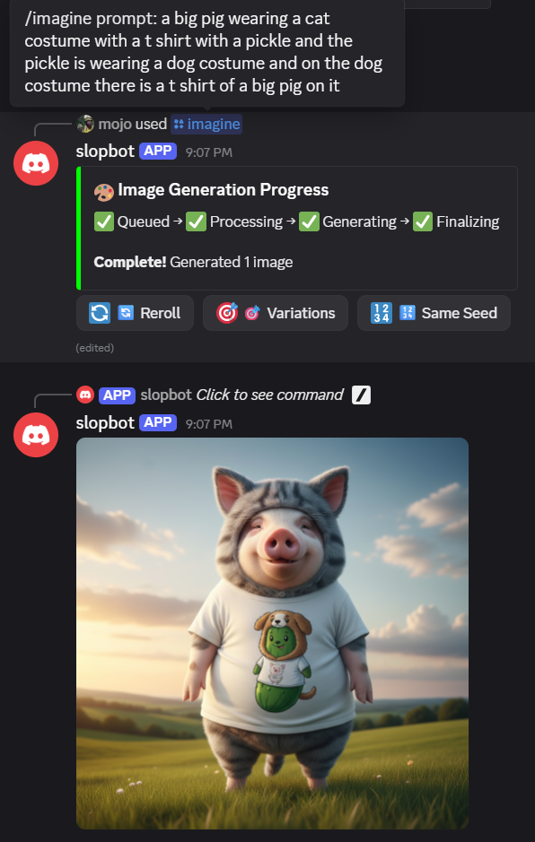

# gemini-nano-banana-discord-bot


Vibe coded with [RooCode.](https://github.com/RooCodeInc/Roo-Code/)


## 🛠️ Development Tools & AI Integrations

[]() []() []() []() []() []() []() []()

[](LICENSE)
[](https://python.org)
[](https://discordpy.readthedocs.io/)
[](https://openrouter.ai/)

gemini-nano-banana-discord-bot
This is a Discord bot for creative image workflows: generate from text, edit existing images with a prompt (optional mask), and blend multiple images—powered by Google’s Gemini 2.5 Flash Image Preview (aka “Nano Banana”) via the OpenRouter API.

It ships with modern slash commands, clear progress embeds, and an iteration UI (Reroll, Variations, Same Seed, ✏️ Edit) so you can rapidly refine results without typing full commands again. Under the hood, an async queue manages concurrency and reliability, and a small FastAPI health server runs alongside the bot for uptime checks.

Overview
At a glance:
- Slash commands: `/imagine`, `/edit`, `/blend`, `/help`, `/info`.
- OpenRouter-backed model calls to `google/gemini-2.5-flash-image-preview` for text-to-image, editing, and multi-image conditioning.
- Async queue with progress embeds for a responsive UX; built-in validation, logging, and rate limiting.
- Companion health server (uvicorn) on port 8000 for container and uptime checks.

Features
AI image generation from prompts with optional style and seed.

Image editing with prompt guidance, optional mask, and multiple sources.

Image blending of 2–6 images with adjustable strength.

Interactive buttons: Reroll, Variations, Same Seed, Edit (modal) to iterate quickly without retyping.

Local caching of generated/edited files to ensure reliable Discord attachments and re-edits.

Robust validation (file type/size), structured logging, and retry/backoff for transient API errors.

Supported model
Model: google/gemini-2.5-flash-image-preview (“Nano Banana”) via OpenRouter.

Capabilities: text-to-image, image editing, multi-image conditioning/blending.

Typical usage context across community docs/videos confirms positioning as “Nano Banana.”

Quick start
1) Prepare environment:
	- Create a Discord application + bot and copy the bot token
	- Get an OpenRouter API key with model access
	- Copy `.env.example` to `.env` and fill in required values
2) Run (choose one):
	- Docker: `docker compose up --build -d`
	- Local dev: `pip install -e .` then `python -m src.bot`
3) Invite the bot to a server (OAuth2 scopes: `bot`, `applications.commands`).
4) In Discord, try `/help`, then `/imagine` with a short prompt.

## Screenshots

See how the bot looks and behaves during common tasks. Each example includes what to look for and how to reproduce it quickly.

### Imagine: Banana

- Clean `/imagine` flow with playful prompt.
- Progress embed shows queue → generation → post-processing.
- Iteration buttons on completion: Reroll, Variations, Same Seed, and ✏️ Edit modal.
- Try it: `/imagine prompt:"a photoreal banana wearing sunglasses, studio lighting"`.

### Imagine: Pig

- Another `/imagine` output demonstrating consistent embeds and metadata.
- The embed includes prompt, model, and seed (when available).
- Try it: `/imagine prompt:"cute pig astronaut, ultra-detailed, dramatic rim light" count:1`.

### Edit Flow

- ✏️ Edit modal in action with progress stages for `/edit`.
- Notes:
	1) Edit prompt is displayed directly in the progress embed.
	2) Edited images are written to cache and reattached from disk to avoid Discord attachment issues.
	3) Iteration buttons remain so you can keep refining results.
- Try it: upload an image then run `/edit prompt:"add neon graffiti background" source1:<attach your image>`.

Tips
- DM the bot for private experiments; iteration controls still work.
- If attachments fail after edits, ensure `CACHE_DIR` (default `.cache`) is writable.

## Repository structure
- `src/bot.py` — bot bootstrap, slash command registration, health server
- `src/commands/` — imagine, edit, blend, help, info command handlers
- `src/commands/utils/` — OpenRouter client, queue, validators, error handling, logging, rate limiter, storage, images, styles
- `src/health_check.py` — FastAPI app for health/readiness/metrics
- `.env.example` — environment variables template
- `Dockerfile` and `docker-compose.yml` — containerization
- `CONFIG.md`, `ENV_SETUP.md`, `SELF_HOSTING.md`, `DEPLOYMENT.md` — additional docs

## Prerequisites
- Discord bot application and token (Developer Portal)
- OpenRouter API key with access to the model
- Python 3.11+ if running locally; Docker optional for deployment
- Populate `.env` from `.env.example`

## Environment variables
Copy `.env.example` to `.env` and fill in values.

- `DISCORD_TOKEN`: Discord bot token
- `OPENROUTER_API_KEY`: OpenRouter API key
- `OPENROUTER_BASE_URL`: Defaults to https://openrouter.ai/api/v1
- `MODEL_ID`: Defaults to google/gemini-2.5-flash-image-preview
- `LOG_LEVEL`: INFO by default; set DEBUG for verbose logs
- `CACHE_DIR`: .cache default for temporary files
- `ALLOWED_IMAGE_TYPES`: png,jpg,jpeg,webp
- `MAX_IMAGE_MB`: 10 (MB)
- `CONCURRENCY`: 2 concurrent operations default

Note: OPENROUTER_API_KEY and DISCORD_TOKEN are required; the app exits early if missing.

## Installation

### Option A — Docker (recommended)
1. Ensure `.env` is populated at project root.
2. Start the stack (PowerShell):

```powershell
docker compose up --build -d
```

3. View logs:

```powershell
docker compose logs -f
```

Health server is exposed at `8000` inside the container.

### Option B — Local (development)
1. Install the package from repo root (with `pyproject.toml`):

```powershell
pip install -e .
```

2. Run the bot:

```powershell
python -m src.bot
```

Set `LOG_LEVEL=DEBUG` in `.env` for development troubleshooting.

## Discord setup
1. Create App + Bot in the Developer Portal
2. OAuth2 → URL Generator: scopes `bot`, `applications.commands`
3. Minimal permissions: Send Messages, Attach Files, Use Slash Commands
4. Invite the bot to a test server via the generated URL
5. On ready, the bot syncs slash commands automatically; if not visible, check token and scopes

Commands
/imagine — Generate images from text.

Parameters: prompt (required), style (optional), count (1–4), seed (optional), format (png|jpg|webp). 

Validates prompt and count; rejects if attachments included by mistake, suggesting /edit.

Uses queue to process and send results with progress stages.

Examples:
- `/imagine prompt:"a foggy cyberpunk alley, neon reflections, moody lighting"`
- `/imagine prompt:"studio portrait of a golden retriever" style:photoreal count:2`

/edit — Edit images with a prompt.

Parameters: prompt (required), source1 (required), source2–source4 (optional), mask (optional), format.

Validates/Downloads attachments (<10MB, allowed types), prepares for API, returns edited results.

Saves edited images to temp for reuse, adds iteration view to re-edit or vary.

Examples:
- `/edit prompt:"replace background with a tropical beach" source1:<attach image>`
- `/edit prompt:"watercolor style" source1:<attach image> mask:<attach mask.png>`

/blend — Blend multiple images.

Parameters: prompt (required), source1–source2 (required), source3–source6 (optional), strength (0.0–1.0), format.

Validates attachments, prepares sources, calls API with strength hint, returns blended images.

Examples:
- `/blend prompt:"surreal fusion" source1:<img1> source2:<img2> strength:0.7`
- `/blend prompt:"double exposure" source1:<portrait> source2:<forest>`

/help — Lists commands and usage.

/info — Shows model, version, usage notes.

## Interactive iteration
After generation/editing, an interactive View adds:

- Reroll — regenerate with same prompt, new seed.
- Variations — generate 4 variations.
- Same Seed — regenerate with the same seed if available.
- Edit — opens modal to apply a new edit to a selected generated result.

Details:
- Reroll: same prompt, fresh randomness for diversity.
- Variations: quick set of 4 alternatives from current context.
- Same Seed: reproduce composition with minor noise changes; great for A/B tweaks.
- ✏️ Edit: opens a modal to enter a new edit prompt and optional target image index.

## Runtime behavior
- Early exit without `DISCORD_TOKEN`; raises `ValueError`.
- OpenRouter client raises if `OPENROUTER_API_KEY` missing.
- Health server runs on port `8000` via uvicorn task.
- Cache directory created if missing by storage utilities.
- API calls include retry/backoff on 429/5xx/timeouts; logs error bodies when available.

Notes:
- Concurrency: Controlled via `CONCURRENCY` (default 2). Increase gradually; high values can trigger Discord/OpenRouter rate limits and make the queue less fair for other users.
- Rate limits: App-level rate limiting complements provider limits. If you see 429s or slowdowns, reduce batch sizes or wait. Check logs for backoff/retry messages.
- Health & observability: Health server listens on port `8000` with `/healthz`, `/ready`, and `/metrics`. Map the port in Docker if you want to reach it from the host.
- Caching: Files are written to `CACHE_DIR` (default `.cache`). Persist this as a Docker volume to enable reliable re-edits and avoid broken Discord attachments. Ensure the directory is writable (Windows/NTFS permissions).
- File limits: Upload validation enforces `ALLOWED_IMAGE_TYPES` and `MAX_IMAGE_MB` (default 10MB). Mismatches or oversized files will be rejected with a friendly error.
- Model/endpoint overrides: You can set `MODEL_ID` and `OPENROUTER_BASE_URL` in `.env`. Make sure your OpenRouter key has access to the chosen model.
- Networking: Corporate proxies/firewalls can block API calls. Configure proxy env vars if needed or test from a different network.
- Logging: Set `LOG_LEVEL=DEBUG` for deeper diagnostics during development; error bodies are logged when available to speed up troubleshooting.

## Troubleshooting
- Container exits immediately: check `docker compose logs` for missing env var `ValueError`.
- Commands fail to sync: confirm correct bot token, scopes, and re-invite with `applications.commands`.
- OpenRouter errors/timeouts: verify `OPENROUTER_BASE_URL`, connectivity, and rate limits; enable `DEBUG` logs.
- Upload validation errors: ensure image types and size limits per config.

## Development
- Tests: run `pytest` from project root.
- Typing/Linting: `pyrightconfig.json` present; typical Python tooling can be used.
- Queue architecture: `AsyncImageQueue` with background worker and Discord embeds for progress stages.
- OpenRouter client: flexible response parsing to extract base64 image data across variants.

## Deployment notes
- Docker container runs `python -m src.bot`; mount `.env` and `.cache` via volumes.
- Expose `8000` if external health checks are desired; compose file maps port accordingly.
- Add a restart policy and `healthcheck` in compose for resilience.

## Security
- Keep API keys and bot tokens in `.env`; do not bake into image layers.
- Privileged intents are disabled by default to avoid errors; re-enable only if needed and approved.
- Review Discord permissions; avoid Administrator in production if not necessary.


Copyright 2025 Kyle Durepos